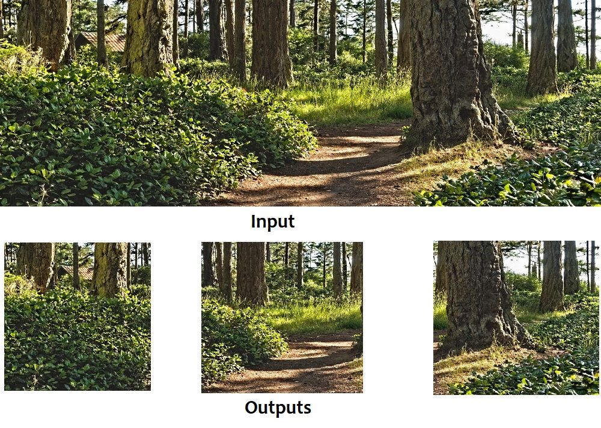

# Tool for cutting up and resizing images into a uniform size.
This algorithm simply takes crops from all images in a folder to achieve:
- All outputs are images with no more than the specified ratio of long-to-short edge
- 100% coverage of the input image (overlapping crops if necessary)
- Resize down if necessary

